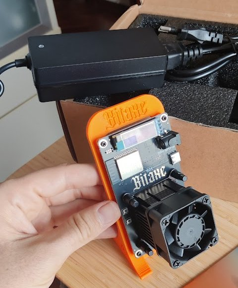
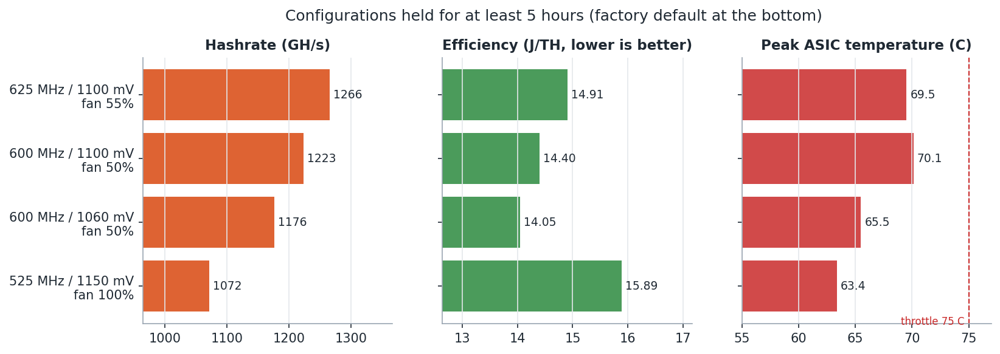

# bitaxe-lab

[](https://github.com/ccalvop/bitaxe-lab/actions/workflows/ci.yml)


How a small home Bitcoin miner, a **Bitaxe Gamma 601**, was checked, set up, measured for a
month and tuned using its own telemetry. Code, data and notes, so the same can be done with
any unit.

## What you will find here

| Folder | Contents |
|--------|----------|
| [`docs/`](docs/) | Eight short guides: from what mining is to the results and the mistakes made |
| [`firmware-verification/`](firmware-verification/) | How to check a miner's firmware byte by byte and flash a clean official image |
| [`collector/`](collector/) | A small program that reads the miner's metrics every 5 minutes into a CSV file |
| [`deploy/`](deploy/) | How to run that collector: Proxmox container, any Linux with systemd, or Docker |
| [`data/`](data/) | One month of real measurements (anonymised) and the description of each column |
| [`analysis/`](analysis/) | Scripts that turn the data into the report and every chart shown here |

Where to start:

- **New to Bitcoin mining**: read the two sections below, then [docs/01](docs/01-bitcoin-and-solo-mining.md)
- **Just bought a Bitaxe**: [firmware verification](firmware-verification/README.md), then the
  [setup guide](docs/07-setup-guide.md)
- **Want to measure your own miner**: [deploy/](deploy/README.md) and the
  [tuning method](docs/05-tuning-methodology.md)

## What a Bitcoin miner does

Bitcoin records transactions in blocks, roughly one every ten minutes. To add a block, a
computer has to find a number that, combined with the block's data and passed through the
SHA-256 hash function, gives a result below a target value. There is no clever way to find
it: the only method is to try one candidate after another, as fast as possible. That
guessing is the "work" in proof of work, and doing it is mining.

Whoever finds a valid block first receives the reward, currently 3.125 BTC plus the
transaction fees. The network adjusts the target so that, however many miners join, a block
is still found every ten minutes on average.

Speed is measured in hashes per second. A laptop processor reaches millions, at best a few billion. A miner uses an
**ASIC**, a chip designed to do only this calculation, and reaches **trillions** per second
(terahashes, TH/s). Electricity goes in, guesses come out, and almost all of the energy ends
up as heat.

Today the whole network makes about 950 million TH/s. A single home miner is a lottery
ticket: miners usually join a pool and share rewards in proportion to their work. This one
does **solo mining**: if it ever finds a block, the whole reward goes to its owner. At its
speed that is expected once every ~15,000 years. The point is not profit.
[More detail](docs/01-bitcoin-and-solo-mining.md).

## The device: Bitaxe Gamma 601



The [Bitaxe](https://github.com/bitaxeorg) is an **open-source** miner: the circuit board
design and the firmware are public and maintained by a community. It is the size of a phone
and runs on a laptop-style power supply.

Inside the Gamma 601:

- **ASIC: one BM1370**, the same chip Bitmain uses in its industrial Antminer S21 Pro. Bitmain
  does not sell it separately, so these boards use chips recovered from industrial hardware
- **Controller: an ESP32-S3** microcontroller. It runs the firmware,
  [esp-miner](https://github.com/bitaxeorg/ESP-Miner), which talks to the pool over Wi-Fi,
  drives the chip and the fan, and serves **AxeOS**: a web page to configure and monitor the
  miner, plus an HTTP API that other programs can read
- **Power: 5 V** from an external supply, about 17 W while mining
- **Cooling**: a heatsink and a small, loud fan

At factory settings it does about **1.07 TH/s**.

Three settings in AxeOS change how it behaves:

| Setting | What it does | Trade-off |
|---------|--------------|-----------|
| **Frequency** (MHz) | how fast the ASIC runs | higher = more hashes per second, but more power and heat |
| **Core voltage** (mV) | power fed to the ASIC so it stays stable at that frequency | lower = less power and heat, until the chip starts making errors |
| **Fan speed** (%) | cooling | faster = cooler chip, more noise |

Finding the best combination for a given chip, room and noise tolerance is what most of this
repository is about.

<br clear="right">

## What was done, in order

1. **Do not trust it as shipped.** Before connecting it anywhere, the flash memory was dumped
   and compared byte by byte with the official release, then a clean official image was
   flashed. The firmware turned out genuine, but the settings were set to pay the seller on
   both pools and overclock the chip by 41 %.
   [Verify and flash](firmware-verification/README.md) · [the story](docs/02-firmware-verification.md)
2. **Give it its own network.** An isolated IoT network: it can reach the pools, nothing else.
   [Network isolation](docs/03-network-isolation.md)
3. **Make sure it mines for its owner.** Own address on both pools, connection encrypted with
   TLS, and a check of the address the miner would actually be paid to.
   [Setup guide](docs/07-setup-guide.md)
4. **Measure it.** A collector on a home server records every metric every 5 minutes. The
   built-in AxeOS logs show what is happening now; comparing settings over days needs data
   that lives outside the device. [Telemetry pipeline](docs/04-telemetry-pipeline.md) ·
   [deploy it](deploy/README.md)
5. **Tune it with the data.** One setting at a time, each held long enough to measure, judged
   on efficiency, temperature and noise. [Method](docs/05-tuning-methodology.md) ·
   [results](docs/06-results.md)

## Results



| | Factory settings | After tuning | Change |
|---|---|---|---|
| Frequency / voltage | 525 MHz / 1150 mV | 600 MHz / 1100 mV | |
| Hashrate | 1072 GH/s | 1223 GH/s | +14 % |
| Efficiency (energy per hash) | 15.89 J/TH | 14.40 J/TH | 9 % less |
| Fan | ~100 % | 50 % | about 5.5 dB quieter |
| Chip temperature | 62.2 C | 62.7 C | +0.5 C |

The approach was to **lower the voltage first** to find how little the chip needs, and only
then raise the frequency. Measured over 7,830 samples, one unit: another chip will have
different margins, which is why the method matters more than the numbers.

## What the data showed

- **The hashrate on the dashboard is an estimate, not a measurement.** It is inferred from the
  results the miner sends to the pool, so a single reading can be off by 5 %. Only averages
  over an hour or more are worth comparing:

  

- **Efficiency depends mostly on voltage.** Power grows with the square of the voltage, while
  hashrate grows with frequency.
- **The stock fan barely responds above 70 %**, and automatic mode kept it at full speed all
  the time. Setting it by hand to 50 % made the noise acceptable.
- **The chip temperature follows the room, not the weather.** The warmest hour for the miner
  was in the evening, after the hottest part of the day.
- **Rejected shares are not a sign of a struggling chip**: here all of them were late
  answers caused by network timing. A chip short of voltage shows up as a hashrate below what
  its frequency should give.

All of them, with the mistakes that led to them, in [lessons learned](docs/08-lessons-learned.md).

## Quick start

**Collect data from your own miner** ([full guide](deploy/README.md)):

```bash
git clone https://github.com/ccalvop/bitaxe-lab.git && cd bitaxe-lab

# on a Debian/Ubuntu host or container with systemd
sudo ./deploy/install.sh --url http://<miner-ip> --expect-address <your-btc-address>

# or anywhere with Docker
cd deploy/docker && BITAXE_URL=http://<miner-ip> docker compose up -d
```

**Reproduce the analysis** (needs [uv](https://docs.astral.sh/uv/)):

```bash
make venv
make report    # one line per configuration, noise by window, restarts, payout check
make charts    # regenerates docs/img from data/metrics.csv
```

**Check a miner you just bought** ([guide](firmware-verification/README.md)):

```bash
esptool --port /dev/ttyACM0 -b 921600 read-flash 0 0x1000000 stock-dump.bin
python3 firmware-verification/verify_firmware.py stock-dump.bin esp-miner-factory-601-v2.15.0.bin
```

## Documentation

1. [Bitcoin mining and solo mining](docs/01-bitcoin-and-solo-mining.md)
2. [Verifying a miner bought from a third party](docs/02-firmware-verification.md)
3. [Network isolation](docs/03-network-isolation.md)
4. [Telemetry pipeline](docs/04-telemetry-pipeline.md)
5. [Tuning methodology](docs/05-tuning-methodology.md)
6. [Results](docs/06-results.md)
7. [Setup guide](docs/07-setup-guide.md)
8. [Lessons learned](docs/08-lessons-learned.md)

## Code and tests

- The collector is a single Python file with no dependencies; the installer can be re-run safely
- Tests use a real, anonymised response from this miner, served by a small fake API, so they
  cover the whole path from HTTP request to CSV row
- CI runs `ruff`, `shellcheck`, the tests on Python 3.9 and 3.12, and builds the Docker image
  and takes a sample from the fake API
- The published data is anonymised by a script, and a test fails if a real address ever
  appears in it. Each column is described in [SCHEMA.md](data/SCHEMA.md)

## Limits

- **One unit.** These chips are recovered from industrial boards and each one has its own
  margins
- Power figures are the board's own measurement, not a wall meter
- Nothing here is financial advice; a Bitaxe will almost certainly never find a block
- Changing voltage and frequency is at your own risk. The firmware stops mining if the chip
  reaches 75 C, but the settings are yours

## License

[MIT](LICENSE)
