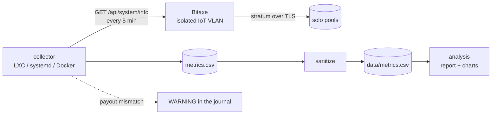

# bitaxe-lab

[](https://github.com/ccalvop/bitaxe-lab/actions/workflows/ci.yml)


Telemetry, analysis and tuning of a **Bitaxe Gamma 601**, an open-source solo Bitcoin miner,
running in a homelab. A month of data, a reproducible method, and the mistakes that shaped it.

The miner itself is a small part. The rest is what an engineer would build around any device
they do not fully trust: verify what it runs, isolate it, measure it continuously, and change
it only when the data says so.

<br clear="right">


## Results at a glance

| | Factory settings | After tuning | |
|---|---|---|---|
| Hashrate | 1072 GH/s | **1223 GH/s** | +14 % |
| Efficiency | 15.89 J/TH | **14.40 J/TH** | -9 % |
| Fan | ~100 %, loud | 50 % | about -5.5 dB |
| ASIC temperature | 62.2 C | 62.7 C | +0.5 C |
| Cost | | **0** | |

Found by **lowering** the voltage and then raising the frequency, measured over 7,830 samples.
Details in [results](docs/06-results.md).

## What is in here

| Part | What it does |
|------|--------------|
| [`collector/`](collector/) | Polls the AxeOS API every 5 minutes into a CSV. One file, standard library only, never crashes, never corrupts the file, warns if the payout address changes |
| [`deploy/`](deploy/) | Run it in a **Proxmox LXC**, on **any Linux with systemd**, or with **Docker**. Idempotent installer, systemd units, compose file |
| [`data/`](data/) | One month of real telemetry (anonymised) and its [schema](data/SCHEMA.md) |
| [`analysis/`](analysis/) | Segmentation by configuration, report, and every chart in this repo, regenerated from the CSV |
| [`firmware-verification/`](firmware-verification/) | Compare a flash dump against an official release, partition by partition, before trusting a device |
| [`docs/`](docs/) | The background, the method, the results and the lessons |

## How it fits together



## Quick start

**Collect data from your own miner** ([full guide](deploy/README.md)):

```bash
git clone https://github.com/ccalvop/bitaxe-lab.git && cd bitaxe-lab

# on a Debian/Ubuntu host or LXC with systemd
sudo ./deploy/install.sh --url http://<miner-ip> --expect-address <your-btc-address>

# or anywhere with Docker
cd deploy/docker && BITAXE_URL=http://<miner-ip> docker compose up -d
```

**Reproduce the analysis** (needs [uv](https://docs.astral.sh/uv/)):

```bash
make venv
make report    # one line per configuration, noise by window, restarts, payout integrity
make charts    # regenerates docs/img from data/metrics.csv
make check     # lint + tests
```

**Check a miner you just bought** ([guide](firmware-verification/README.md)):

```bash
esptool --port /dev/ttyACM0 -b 921600 read-flash 0 0x1000000 stock-dump.bin
python3 firmware-verification/verify_firmware.py stock-dump.bin esp-miner-factory-601-v2.15.0.bin
```

## Findings worth reading

- **The dashboard hashrate is an estimate, not a measurement.** One reading swings by 5 %;
  it takes an hour to see a 2 % difference. Power is the signal to trust.
  
- **Efficiency is set mostly by voltage, not frequency.** Lowering the voltage first and
  raising the frequency second gave 14 % more hashrate with better J/TH than factory. The
  settings shared in marketplace reviews kept or raised the voltage.
  [Methodology](docs/05-tuning-methodology.md)
- **A genuine firmware can still mine for someone else.** The unit was byte-identical to the
  official release, and configured to pay the seller on both pools.
  [Firmware verification](docs/02-firmware-verification.md)
- **The stock fan has no control above 70 %.** Automatic mode aimed at 60 C on this unit, so a chip at 62 C
  kept it at full speed all the time. [Results](docs/06-results.md#the-stock-fan)
- **A container that "does not boot" for five minutes** was waiting for an IPv6 DHCP lease.
  [Deployment traps](deploy/README.md#3-three-traps-found-on-the-way)

## Why not just use the AxeOS logs?

They show what the miner is doing now. The question here was which settings are better over
days, across reboots and changes, with statistics and charts. That needs data that lives
outside the device and carries its configuration in every row.
[More](docs/04-telemetry-pipeline.md#why-not-the-built-in-logs-and-statistics)

## Documentation

1. [Bitcoin mining and solo mining, in one page](docs/01-bitcoin-and-solo-mining.md)
2. [Verifying a miner bought from a third party](docs/02-firmware-verification.md)
3. [Network isolation](docs/03-network-isolation.md)
4. [Telemetry pipeline](docs/04-telemetry-pipeline.md)
5. [Tuning methodology](docs/05-tuning-methodology.md)
6. [Results](docs/06-results.md)
7. [Setup guide](docs/07-setup-guide.md)
8. [Lessons learned](docs/08-lessons-learned.md)

## Engineering notes

- **Tests against the real API shape**: the fixture is a real, anonymised response from this
  miner, served by a small mock so tests and CI exercise HTTP, parsing and the CSV end to end
- **CI**: `ruff`, `shellcheck`, `pytest` on Python 3.9 and 3.12, and a job that builds the
  Docker image and takes a sample from the mock API
- **Privacy guard**: the published dataset is anonymised by script, and a test fails the build
  if a real address ever reaches `data/`
- **Data contract**: every column, unit and quirk documented in [SCHEMA.md](data/SCHEMA.md)

## Scope and limits

- **One unit.** These chips are recovered from industrial boards and each has its own margins.
  The numbers here are a data point; the method is the transferable part
- Power is the board's own measurement, not a wall meter
- No dashboards or alerting stack: the collector writes a CSV and logs a warning, on purpose
- Nothing here is financial advice. A Bitaxe will almost certainly never find a block
- Tuning is at your own risk; the firmware stops mining above 75 C, but voltage changes are
  yours to own

## License

[MIT](LICENSE)
