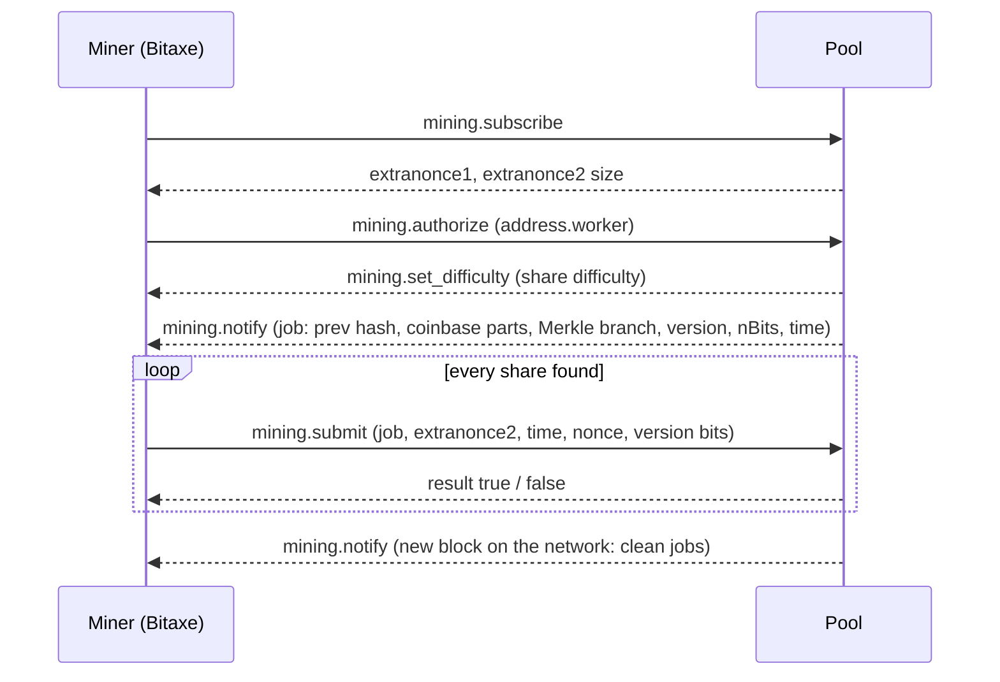

# 1. Bitcoin mining and solo mining, in one page

Enough background to read the rest of this repository. Numbers are from October 2026.

## What a miner actually does

A Bitcoin block header is 80 bytes: version, hash of the previous block, Merkle root of the
transactions, timestamp, difficulty target (`nBits`) and a 32-bit `nonce`. Mining is hashing
that header twice with SHA-256 and checking whether the result, read as a number, is below the
target. If it is, the block is valid. If not, change something and try again.

There is no shortcut. The only strategy is to try as many headers per second as possible,
which is what an ASIC (application-specific integrated circuit) does.

The 32-bit nonce gives about 4.3 billion attempts. At 1.2 TH/s that is used up in **3.6 ms**,
so the miner must keep changing other fields:

- **Version rolling**: some bits of the version field are free to change (the `ver:` values
  in the AxeOS log are exactly that)
- **Extranonce**: a counter inside the coinbase transaction. Changing it changes the Merkle
  root, which opens a fresh 2^32 nonce space

## Difficulty and why solo mining is a lottery

Difficulty `D` sets how small the hash must be. On average a block needs `D x 2^32` hashes.

| | value |
|---|---|
| Network difficulty | 132.7 T |
| Hashes per block | ~5.7 x 10^23 |
| Network hashrate | ~950 EH/s |
| This miner | ~1.22 TH/s, about 1 / 780,000,000 of the network |
| Expected time to find a block alone | **~14,800 years** |
| Chance of at least one block in a year | **about 1 in 14,800** |

Finding blocks is a Poisson process: there is no progress, no "getting closer". Each hash is
an independent ticket. That is why solo miners with a few TH/s do, occasionally, win a whole
block: it is rare, not impossible.

## Pools, shares and solo pools

A pool hands the miner work and asks it to submit **shares**: hashes that meet a much easier
difficulty set by the pool (1000 here, about one share every 3.6 s at this hashrate). Shares
prove the miner is working. They are not blocks.

- **Pooled mining** (PPLNS, FPPS...): rewards are split in proportion to shares. Small, steady
  income
- **Solo mining**: the pool only relays work and the miner keeps the whole block reward if one
  of its shares happens to also meet the network difficulty. All or nothing

A non-custodial solo pool writes **your address into the coinbase transaction** of the block
template it gives you. If your miner finds the block, the reward is created directly in your
address by the block itself. The pool never holds the funds.

## The coinbase transaction

The first transaction of every block. It creates the block subsidy (3.125 BTC since the 2024
halving) plus the fees of the included transactions, around 3.16 to 3.20 BTC in the templates
seen here. Coinbase outputs can only be spent after **100 confirmations**, about 17 hours.

With `stratumDecodeCoinbase` enabled, AxeOS decodes the coinbase of the template it is hashing
and shows the payout outputs. That is the strongest answer to "am I mining for myself?": not
which username you authenticated with, but whom the block would actually pay.

```
stratum_v1_task: Coinbase outputs: 2, total value: 319370337 sats
stratum_v1_task: Output 0: bc1q...(319370337 sat) (Your payout address)
stratum_v1_task: Output 1: OP_RETURN: ...
```

## Stratum, the protocol between miner and pool



Stratum V1 is JSON over plain TCP: anyone on the path can read your address and your shares.
Wrapping it in **TLS** hides that from your ISP and prevents tampering. It does not hide
anything from the pool, and a found block is public on the chain anyway.

**Stratum V2** is a different protocol: binary, encrypted with the Noise framework, and with an
optional *job declaration* mode where the miner builds its own block template from its own
node instead of accepting the pool's.

## The Bitaxe

An open-source hardware miner: board design and firmware are public. The Gamma 601 has one
**BM1370**, the same ASIC used in Bitmain's Antminer S21 Pro. Bitmain does not sell the chip
on its own, so these boards use chips recovered from industrial hashboards. An ESP32-S3 runs
the firmware ([esp-miner](https://github.com/bitaxeorg/ESP-Miner)), talks Stratum over Wi-Fi
and serves the AxeOS web UI and its HTTP API.

| | Gamma 601 |
|---|---|
| ASIC | BM1370 |
| Controller | ESP32-S3-WROOM-1, 16 MB flash, 8 MB PSRAM |
| Hashrate at factory settings | ~1.07 TH/s |
| Power | ~17 W measured on the board, ~20 W at the wall (estimated, 85% supply efficiency) |
| Supply | 5 V barrel jack (6 A unit included) |
| Network | 2.4 GHz Wi-Fi only |

It will almost certainly never find a block. It is a cheap, quiet-ish way to take part in
the network, to understand how mining works end to end, and in this repository, an excuse to
build and measure something properly.
