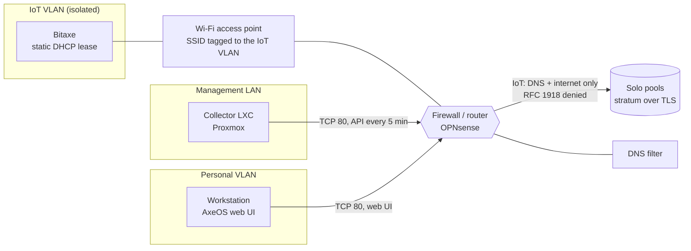

# 3. Network isolation

A miner is unaudited hardware with a permanent outbound connection. It gets its own network.

## Layout



| Flow | Allowed | Why |
|------|---------|-----|
| Miner to internet (pools, NTP) | yes | it has to mine |
| Miner to DNS server | yes | pool host names |
| Miner to any private range | **no** | the point of the exercise |
| Collector and workstation to miner, TCP 80 | yes | inbound to the IoT VLAN, isolation unchanged |

Isolation was tested from inside the IoT VLAN, not assumed: the gateways of the other
networks did not answer, the pool ports did.

## Checklist before plugging it in

- **Reserve a static IP** for the miner's **station** MAC (the one esptool prints). The ESP32
  also has a soft-AP MAC, base + 1, used only by its setup hotspot
- **Make sure the DNS filter does not block pool domains.** Some blocklists include mining
  domains, and a miner that cannot resolve its pool looks exactly like broken firmware
- **2.4 GHz only.** The ESP32 does not do 5 GHz

## Trap 1: the SSID is case sensitive

After entering the Wi-Fi credentials in the setup page the screen showed the network name, yet
the miner never appeared. The serial console (`cat /dev/ttyACM0` with the board on USB) gave the
exact reason in seconds:

```
connect: Could not connect to 'Home-iot' [rssi -128]: reason 201
connect: Wi-Fi status: No access point found (Error 201, retry #1)
```

`201` is *no AP found* and `rssi -128` means no signal at all. The phone keyboard had
capitalised the first letter. A wrong password would have produced a different reason code
(15, handshake timeout). The serial console turns guessing into reading.

## Trap 2: pinging the gateway proves nothing

To check that the workstation could reach the IoT VLAN, the first test pinged its gateway
address, which answered. Conclusion: reachable. Wrong. The gateway address **is an interface of
the firewall itself**: it answers from the router, not from inside the network. The miner
itself was unreachable.

Test the host you care about, on the port you care about.

## Trap 3: client isolation hiding in the access point

The miner was online and mining, but its web UI could not be reached from anywhere, **not even
from a phone on the same Wi-Fi**. Traffic between two clients of the same SSID never crosses
the firewall, so the firewall was ruled out at once.

The cause was a per-SSID option in the TP-Link EAP access point called **Guest Network**, which
on that hardware means client isolation: clients can go out, nobody can connect in. It was
enabled on the IoT SSID only, and the homelab documentation said it was off.

| Layer | What it isolates | Status after the fix |
|-------|------------------|----------------------|
| Firewall between VLANs | IoT devices from every other network | unchanged, verified |
| Access point client isolation | IoT devices from each other | disabled on this SSID |

The second layer was given up so the miner could be managed and monitored. The first one is
the one that protects everything else, and it was re-tested afterwards. To compensate, the
collector checks on every sample that the payout address has not changed, which is what an
attacker on the same network would go after.

## Things the firmware exposes on its own

Worth knowing about any device of this kind:

- During setup the miner runs an **open Wi-Fi hotspot** (no password) to receive its
  configuration. In this unit it stayed up for a while after joining the real network
  (the ESP32 runs station and access point at the same time). Check `apEnabled` in
  `/api/system/info` after configuration
- It also advertises over **Bluetooth LE** for setup
- The web UI and API on port 80 have **no authentication**. Anyone who can reach it can
  change the pool. That is why it should only be reachable from networks you control

## Encrypting the pool connection

Both pools used here offer Stratum over TLS on a separate port. Checked before switching:
the port speaks Stratum (a `mining.subscribe` over `openssl s_client` gets a job back), the
certificate covers the host name, and its Let's Encrypt root (ISRG Root X1/X2) is in the
firmware's bundle, so AxeOS's `TLS (System certificate)` option works without custom
certificates.

| Pool | Plain | TLS |
|------|-------|-----|
| pool.bitronics.store | 3333 | 3443 |
| public-pool.io | 3333 | 4333 |

Switch **both** pools, primary and fallback. Otherwise a failover silently goes back to
plain text.
