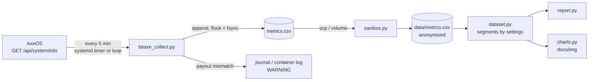

# 4. Telemetry pipeline

Deployment instructions are in [deploy/](../deploy/). This page is about the design.

## Why not the built-in logs and statistics?

AxeOS has a live log view and, in recent versions, a *Statistics* option that keeps samples
on the device. They are good at what they are for: seeing what the miner is doing now.

The question here was different: **which configuration is better, measured over days, across
reboots and changes of settings?**

| Need | AxeOS logs / statistics | This collector |
|------|-------------------------|----------------|
| Resolution over a month | up to 1 month at 1-hour resolution | 5 minutes, unlimited |
| Where data lives | device memory | disk on another host |
| Compare periods with different settings | no | every row carries its settings |
| Independent of the device | no, stored on the miner itself | yes, and outages are recorded as gaps |
| Offline analysis, charts, statistics | no | plain CSV |
| Alert if the payout address changes | no | yes |

## Data flow

## Design decisions

**Pull, one shot, every five minutes.** The collector takes one sample and exits; systemd
schedules it. No daemon to keep alive, no state between runs. In a container, where there is no
systemd, the same code runs in a loop (`--interval`).

**Never crash, never corrupt.** Any failure to reach the miner becomes a row with
`status=error:<Exception>` and blank metrics. Gaps stay visible in the data instead of
silently shrinking it. Rows are appended under an exclusive `flock` and `fsync`ed, so two
overlapping runs cannot interleave and a power cut cannot leave half a line.

**Standard library only.** It runs on a bare Debian template or `python:3.12-slim`, with
nothing to install and nothing to update. It supports Python 3.9 to 3.12 (CI tests both ends).

**Every row carries its configuration.** Frequency, voltage and fan speed are recorded with
each sample, so one continuous file holds all the experiments and the analysis can segment it
afterwards. No manual log of "what did I change and when".

**Integrity check on what matters.** `--expect-address` compares the expected payout address
with the stratum user *and* with the largest output of the decoded coinbase template. The
second one is what a block would really pay. A mismatch is logged as a `WARNING`.

**Publish only anonymised data.** `sanitize.py` replaces the address and worker name with the
BIP-173 example address and refuses to finish if any forbidden string survives. A test in CI
fails if any other address ever appears in `data/metrics.csv`.

**Tests against the real API shape.** The test fixture is a real `/api/system/info` response
from this miner, anonymised. A tiny HTTP server serves it, so tests and the Docker job in CI
exercise the full path: HTTP, JSON, mapping, CSV.

## What the data contains

25 columns, documented in [data/SCHEMA.md](../data/SCHEMA.md). Three properties shape every
analysis:

- `hashrate_ghs` is an **estimate** derived from shares, so it is noisy
- `shares_*` and `best_session_diff` are counters that **reset on reboot**
- `temp_asic_c` is `-1` and the hashrate 0 while the ASIC boots

## What I would add next time

The API exposes fields that turned out to be more useful than some of the ones collected, but
the schema was kept stable so the whole month stays in one consistent file:

- `expectedHashrate`: the firmware's own linear expectation, which is exactly the yardstick
  used in the analysis
- `errorPercentage` and the per-domain `errorCount` in `hashrateMonitor`: ASIC computation
  errors, a direct stability signal. Rejected shares are not one (see the methodology)
- `hashRate_1h`: a smoothed hashrate computed on the device
- `temptarget`: the temperature the automatic fan control aims at
