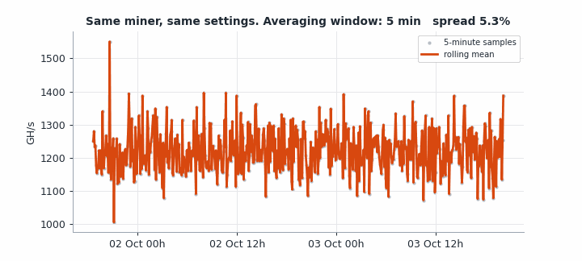
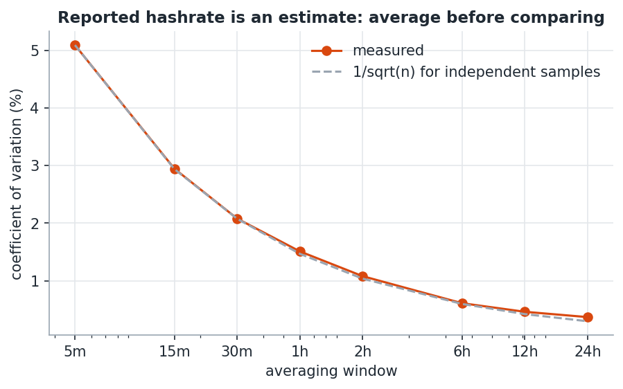
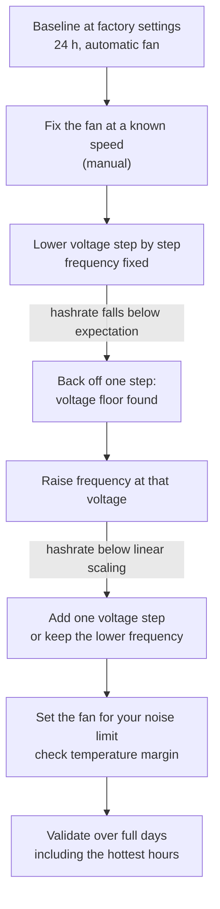
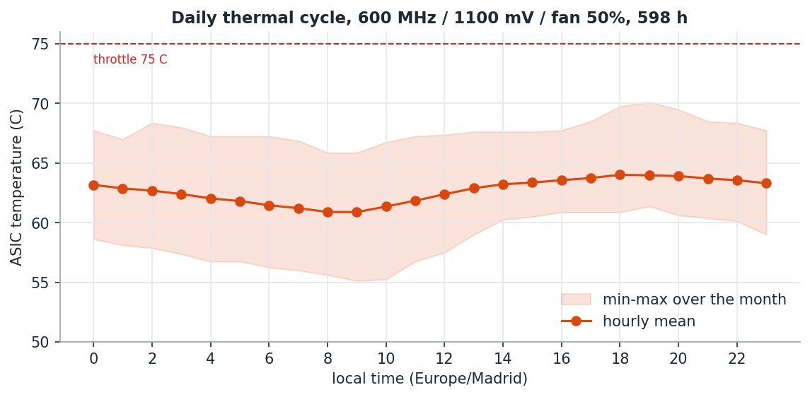

# 5. Tuning methodology: deciding with data, not with reviews

Marketplace reviews are full of settings: "set 625 MHz and 1200 mV, it does 1.3 TH/s". They
rarely say at what temperature, at what efficiency, for how long, or how the number was read.
This page is the method used here, so you can find **your** chip's settings instead of copying
someone else's.

## 1. Know what you are measuring

**The hashrate AxeOS reports is not measured, it is estimated** from how many shares the miner
finds and at what difficulty. Finding shares is random, so the estimate is noisy. Same miner,
same settings, one month:

| Averaging window | Spread (coefficient of variation) |
|------------------|-----------------------------------|
| one 5-minute sample | 5.4 % |
| 30 minutes | 2.2 % |
| 1 hour | 1.6 % |
| 6 hours | 0.6 % |
| 24 hours | 0.4 % |

The measured curve sits on top of the `1/sqrt(n)` line for independent samples. That is the
signature of pure sampling noise from share arrivals, not of an unstable chip.

Consequences:

- **Never compare single readings.** A "1.30 TH/s" on the dashboard is one draw
- **One hour per step is the minimum** to see a difference of a few percent; six hours to be
  confident about 1 to 2 %
- **Power is the reliable signal.** It is measured directly and barely moves: when power
  changes, something really changed
- Compute efficiency yourself as mean power over mean hashrate, from the same window

## 2. One variable at a time, in the right order

Three knobs: core voltage, ASIC frequency, fan speed. They interact, so the order matters.

**Voltage before frequency.** Efficiency is set mostly by voltage. Power goes roughly with
`frequency x voltage^2` while hashrate goes with frequency, so in J/TH the frequency cancels
out and the voltage stays. Find how low the voltage can go first.

**Voltage before fan.** Lowering the voltage reduces the heat produced. Tuning the fan first
means measuring its limit with heat you are about to remove, and doing it twice.

**Fix the fan during voltage and frequency steps, even at 100 %.** In automatic mode the fan
reacts to temperature and compensates exactly the change you are trying to measure.

**Never change two things at once.** Lower voltage can cause computation errors; a slower fan
causes heat. Both show up as worse results, and each has the opposite fix.

## 3. Read the right stability signal

The expected hashrate scales linearly with frequency. Compare each step against that:

| Setting | Measured | Linear expectation | Gap |
|---------|----------|--------------------|-----|
| 600 MHz / 1060 mV | 1176 GH/s | 1225 | **-4.0 %** |
| 600 MHz / 1100 mV | 1223 GH/s | 1225 | -0.1 % |
| 625 MHz / 1060 mV | 1214 GH/s | 1276 | **-4.8 %** |
| 625 MHz / 1100 mV | 1266 GH/s | 1276 | -0.8 % |

A chip without enough voltage does not stop: it keeps hashing and silently produces fewer
valid results. **Rejected shares do not catch this.** All 790 rejections in the month were
`Stale`: shares that arrived after the network had moved to a new job. That is latency, not
the chip. The direct signal is the ASIC error counter in the API (`errorPercentage`,
`hashrateMonitor`), which this dataset did not collect.

## 4. Know the real limits, from the source

Thresholds in forums vary. The firmware has its own, in
[`power_management_task.c`](https://github.com/bitaxeorg/ESP-Miner/blob/master/main/tasks/power_management_task.c):

| Constant | Value | Meaning |
|----------|-------|---------|
| `THROTTLE_TEMP` | 75 C | ASIC: mining stops, fan to 100 %, safe mode |
| `MAX_TEMP` | 90 C | ASIC maximum |
| `SAFE_TEMP` | 45 C | ASIC must cool to this before resuming |
| `TPS546_THROTTLE_TEMP` | 105 C | voltage regulator |

On this board the **ASIC is the limiting component**, not the regulator. Crossing the limit
does not damage anything: the firmware stops mining until it cools down. It does cost lost
time, so leave margin.

The automatic fan control targets `temptarget` (60 C on this unit, readable in the API). A chip
that runs at 62 C will keep the fan at full speed forever, which is why "automatic" sounded
like a jet engine here.

## 5. Validate against the worst hour, not the best one

The ASIC temperature follows the **room**, not the weather, and the room lags behind. In this
west-facing room the chip is coolest around 08:00 and hottest around 18:00 to 19:00. On a
35 C afternoon the ASIC was cooler at 18:00 than at 21:00, when it was 30 C outside.

Two mistakes avoided only because of the data:

- Projecting the ASIC temperature from the outdoor forecast. It does not track it
- Judging a setting by a one-hour test in the morning. Validate across full days, including the
  late afternoon, ideally in the warmest season you expect

## 6. Stop criteria

Stop and step back when any of these happens over a window of at least one hour:

- The hashrate falls clearly below the linear expectation
- The ASIC peaks within a few degrees of 75 C in the hottest hour of the day
- The fan needed to stay in that margin is louder than you accept

The results of applying this to one unit are in [06-results.md](06-results.md).
