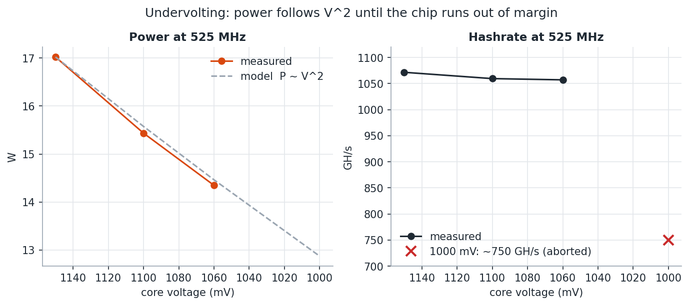
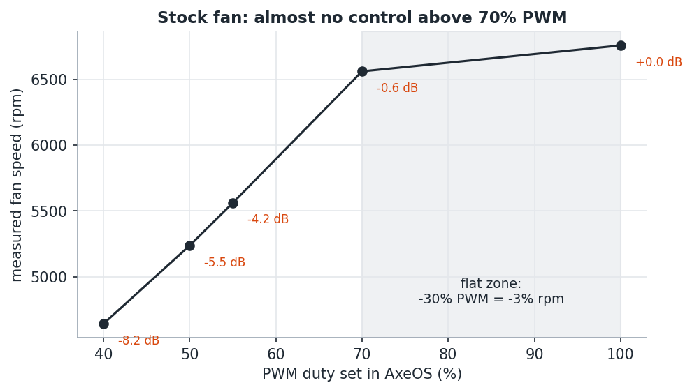
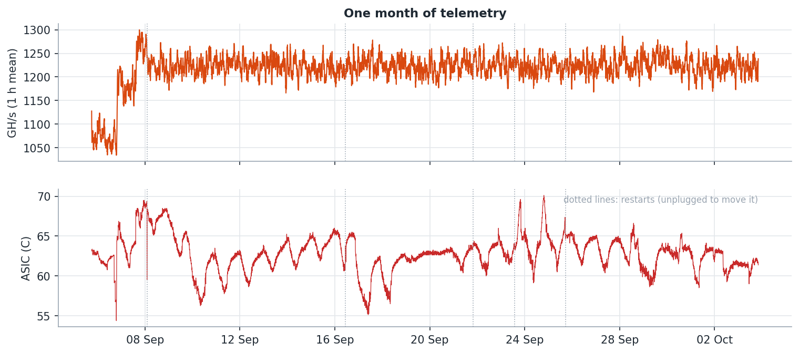

# 6. Results for one Bitaxe Gamma 601

One unit, one room, September to October 2026. 7,830 samples, every figure regenerated from
[`data/metrics.csv`](../data/metrics.csv) by [`analysis/charts.py`](../analysis/charts.py).
Your chip will differ: these chips are recovered from industrial boards and each one has its
own margins.

## Every configuration tested

| Frequency | Voltage | Fan | Hours | GH/s | W | J/TH | ASIC mean | ASIC max |
|-----------|---------|-----|-------|------|---|------|-----------|----------|
| 525 MHz | 1150 mV | auto (~100 %) | 21.8 | 1072 | 17.02 | 15.89 | 62.2 | 63.4 |
| 525 MHz | 1100 mV | 100 % | 0.8 | 1059 | 15.44 | 14.57 | 59.3 | 59.4 |
| 525 MHz | 1060 mV | 100 % | 0.8 | 1057 | 14.35 | 13.57 | 56.8 | 57.0 |
| 525 MHz | 1000 mV | 100 % | aborted | ~750 | | | 54.6 | |
| 600 MHz | 1060 mV | 50 % | 16.3 | 1176 | 16.52 | 14.05 | 63.5 | 65.5 |
| 625 MHz | 1060 mV | 50 % | 1.5 | 1214 | 17.42 | 14.35 | 66.2 | 66.9 |
| 625 MHz | 1100 mV | 55 % | 10.8 | 1266 | 18.87 | 14.91 | 68.1 | 69.5 |
| **600 MHz** | **1100 mV** | **50 %** | **597.8** | **1223** | **17.61** | **14.40** | **62.7** | **70.1** |

Short rows are exploration steps; the last one is the configuration that ran for a month.
The first 15 minutes after each change are excluded while the temperature settles.

## Undervolting

At 525 MHz the measured power follows the `V^2` model closely from 1150 down to 1060 mV:
**-16 % power for the same work.** At 1000 mV the hashrate collapsed by about 30 % within
minutes and the step was aborted. The floor of this chip at 525 MHz is between 1000 and
1060 mV.

At higher frequency the floor moves up. At 600 and 625 MHz, 1060 mV costs 4 to 5 % of the
expected hashrate; 1100 mV recovers it (see [methodology, section 3](05-tuning-methodology.md#3-read-the-right-stability-signal)).

Efficiency also depends on temperature: same voltage, 525 MHz at 57 C gave 13.57 J/TH and
600 MHz at 63 C gave 14.05. Silicon leaks more current when hot.

## The stock fan

From 100 % to 70 % PWM the speed drops only 3 %: the control is flat at the top. All the
useful range is below 70 %. At 50 % the fan is about 5.5 dB quieter than at full speed, the
difference between "audible through a wall" and "fine in the next room".

## One month at the final setting

- **Hashrate**: 1223 GH/s mean, within 0.1 % of linear scaling from the factory baseline
- **Temperature**: 62.7 C mean, 70.1 C peak during a heat wave, 4.9 C below the throttle point
- **Payout integrity**: every sample paid the expected address, never on the fallback pool
- **Rejected shares**: 0.37 %, all `Stale` (network timing)
- **Memory**: free heap flat at 7.65 MB all month, no leak
- **Supply**: input voltage between 4.98 and 5.27 V
- **Restarts**: five, all explained (one settings change, four times unplugged to move it).
  The firmware reported `Reset due to power-on event`

## Versus factory settings

| | Factory | Final | Change |
|---|---|---|---|
| Hashrate | 1072 GH/s | 1223 GH/s | **+14.2 %** |
| Efficiency | 15.89 J/TH | 14.40 J/TH | **-9.4 %** (better) |
| Power on the board | 17.02 W | 17.61 W | +3.5 % |
| Fan | ~100 % | 50 % | **about -5.5 dB** |
| ASIC mean temperature | 62.2 C | 62.7 C | +0.5 C |

More work per second, less energy per hash, much quieter, at almost the same temperature,
without buying anything. A lower-heat alternative that was also measured: 600 MHz / 1060 mV,
14.05 J/TH, 1176 GH/s and a 65.5 C peak.

## Power supply headroom

The included supply is 5 V / 6 A, 30 W. At the final setting the board draws 17.6 W, **59 %
of the supply**, a comfortable point for a switching supply. Pushing to 1.5 TH/s with more
voltage would mean 27 to 35 W, at or beyond its rating: overclocking this far also means a
bigger supply.

## What it means for the lottery

| | Factory | Final |
|---|---|---|
| Expected time to a block (difficulty 132.7 T) | ~16,900 years | ~14,800 years |
| Chance in one year | 1 in ~16,900 | 1 in ~14,800 |

A 14 % better ticket. Still a ticket.
